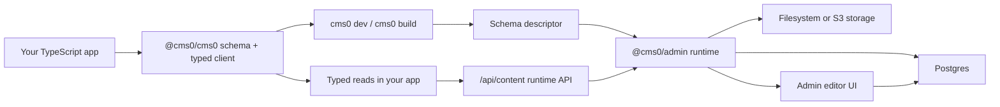

# cms0

> A very naive and opinionated, developer-first headless CMS for every modern TypeScript framework. Self-hostable and free.

> Human x LLM build note: cms0 has been highly co-written by Jeff and LLMs, both paid and free. The goal is still very human: keep content modeling close to application code, keep the editor usable, and keep the runtime understandable.

cms0 is a code-first headless CMS for TypeScript projects. You describe your content shape in code, publish that shape into a self-hosted admin runtime, edit content in the admin UI, and read the result from your app through typed accessors.

The current core repository contains the self-hostable product: the SDK and CLI, the admin app, the docs app, reusable runtime packages, shared UI, and release tooling.

## How It Works

cms0 keeps the content contract in your application code and lets the admin runtime build editing and API behavior from that contract.



The loop is:

1. Define content types with TypeScript.
2. Run `cms0 dev` locally or `cms0 build` in CI.
3. cms0 publishes a schema descriptor to `@cms0/admin`.
4. Editors update content in the admin UI.
5. Your app reads saved content through `@cms0/cms0`.

## Packages And Apps

- `packages/cms0`: public SDK and CLI package.
- `apps/admin`: self-hosted Next.js admin app and runtime API host.
- `apps/docs`: public documentation site.
- `packages/admin-server`: admin server routing, adapters, graph/runtime behavior, backups, data transfer, and triggers.
- `packages/admin-client`: typed client helpers and React Query hooks for admin server APIs.
- `packages/admin-contract`: shared request and response contracts.
- `packages/shared`: descriptor, graph query, storage, email, and common utility contracts.
- `packages/auth`: reusable auth helpers, permissions, session defaults, and auth factory building blocks.
- `packages/ui`: shared shadcn-based primitives and reusable admin UI.
- `packages/transactional`: provider-agnostic transactional email helpers.
- `packages/api-docs`: OpenAPI generation helpers.
- `packages/db-schema-ops`: schema push and database operation helpers.
- `examples/reproduce-bug`: local SDK smoke and reproduction workspace.

## Local Development

Requirements:

- Node.js 22 or newer.
- pnpm 10.
- PostgreSQL.

Install dependencies:

```bash
pnpm install
```

Create local environment files:

```bash
cp apps/admin/.env.example apps/admin/.env.local
pnpm generate:docs-env
```

Edit `apps/admin/.env.local`, especially:

- `DATABASE_URL`
- `BETTER_AUTH_SECRET`
- `CMS0_PUBLIC_APP_URL`
- `BETTER_AUTH_URL`
- `TRUSTED_ORIGINS`
- `ADMIN_EMAIL`
- `ADMIN_PASSWORD`
- `ORG_NAME`
- storage and email variables

Run the admin and docs:

```bash
pnpm dev:admin
pnpm dev:docs
```

The default local admin origin is `http://localhost:3000`. The runtime API base URL is:

```txt
http://localhost:3000/api/content
```

## Docker Quickstart

The repository includes a local-first Docker Compose stack for the self-hosted admin and Postgres.

```bash
cp deploy/docker/admin.env.example deploy/docker/admin.env
```

Edit `deploy/docker/admin.env`, then run:

```bash
pnpm docker:admin:build
pnpm docker:admin:up
```

The admin runs at `http://localhost:3000`. The stack uses named Docker volumes for Postgres data and admin storage, so uploads, snapshots, and backups survive container restarts.

Check readiness with:

```bash
curl http://localhost:3000/api/health
```

Read [deploy/docker/README.md](./deploy/docker/README.md) and the [self-hosting deployment docs](./apps/docs/content/self-hosting/deployment.mdx) before using Docker outside local development.

## Using cms0 From An App

Install the SDK in your TypeScript app:

```bash
pnpm add @cms0/cms0
```

Create a typed cms0 entry:

```ts
import { cms0 } from "@cms0/cms0";

type RootSchema = {
  homePage: {
    headline: string;
  };
};

export const cms = cms0<RootSchema>({
  apiConfig: {
    baseUrl: process.env.CMS0_API_BASE_URL,
    key: process.env.CMS0_API_KEY,
  },
});
```

Create `cms0.config.ts` next to your app package:

```ts
import "dotenv/config";
import { defineConfig } from "@cms0/cms0/config";

export default defineConfig({
  entry: "./src/cms0.ts",
  api: {
    baseUrl: process.env.CMS0_API_BASE_URL,
    key: process.env.CMS0_API_KEY,
  },
});
```

Publish the schema:

```bash
pnpm exec cms0 dev
```

Then open the admin UI, edit content, and read it back:

```ts
const homePage = await cms.homePage();
console.log(homePage.headline);
```

## Documentation

- [Start here](./apps/docs/content/getting-started/index.mdx): full first loop from schema to edited content.
- [Self-hosting](./apps/docs/content/self-hosting/index.mdx): admin runtime setup, environment, deployment, and operations.
- [App integration](./apps/docs/content/app-integration/index.mdx): wiring `@cms0/cms0` into an app.
- [Content modeling](./apps/docs/content/content-modeling/index.mdx): schema shape and modeling guidance.
- [Reference](./apps/docs/content/reference/index.mdx): runtime and package reference pages.
- [Troubleshooting](./apps/docs/content/troubleshooting/index.mdx): common setup and runtime problems.
- [License](./LICENSE): workspace license map and standard license text locations.

Run the docs locally with:

```bash
pnpm dev:docs
```

## Common Commands

- `pnpm dev:admin`: run the self-hosted admin.
- `pnpm dev:docs`: run docs on port `3008`.
- `pnpm typecheck`: run TypeScript checks through Turbo.
- `pnpm test`: run unit and integration tests.
- `pnpm build`: build packages and apps.
- `pnpm test:e2e`: run the admin Playwright suite.
- `pnpm docker:admin:build`: build the local Docker admin image.
- `pnpm docker:admin:up`: start the Docker admin and Postgres stack.
- `pnpm docker:admin:down`: stop the Docker admin and Postgres stack.
- `pnpm changeset`: create a release changeset for publishable package changes.
- `pnpm verify:publish`: pack and inspect publishable package tarballs.

## License

cms0 uses standard open-source licenses per workspace.

Each app, example, and package has its own `LICENSE` file. npm packages also declare the same license in `package.json`.

- SDK, client, shared contract, UI, email, docs, and API helper workspaces use the Apache License 2.0.
- `apps/admin`, `@cms0/admin-server`, and `@cms0/db-schema-ops` use the GNU Affero General Public License v3.0 or later.

See [LICENSE](./LICENSE) for the workspace map.

## Contributing

cms0 is early, opinionated, and still being shaped. Contributions are welcome when they make the core product clearer, safer, easier to run, or easier to build with.

Read [CONTRIBUTING.md](./CONTRIBUTING.md) before opening a pull request.

Contributors should create their own feature or fix branch from `staging`, then open a pull request back into `staging`. `main` is reserved for production releases.

If you use an AI coding assistant, also read [.agents/AI_CONTRIBUTING.md](./.agents/AI_CONTRIBUTING.md). Human-facing project rules stay in this README and `CONTRIBUTING.md`; assistant-specific workflow rules live under `.agents`.

## Release Status

The publishable package workspaces are managed with Changesets. Apps under `apps/*`, including `@cms0/admin` and `@cms0/docs`, are private deployables for now and are not published to npm from this repository.
